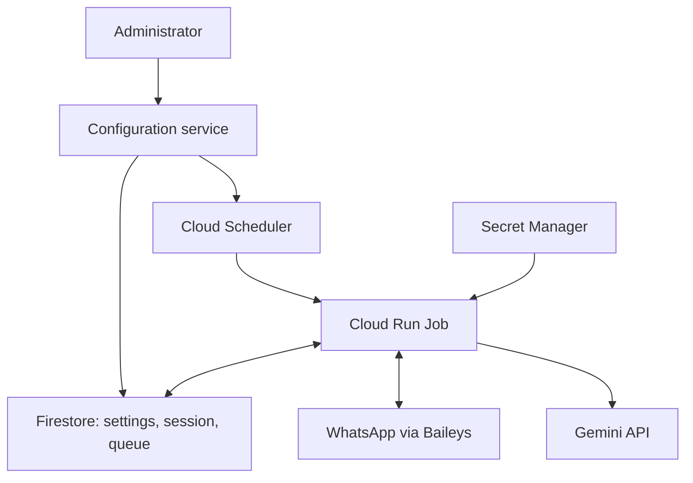

# ADR-0001: Scheduled execution of the WhatsApp bot on GCP

**Date:** 2026-10-07 · **Status:** Target architecture; not yet implemented.

## Decision

Run the bot as a **Cloud Run Job triggered by Cloud Scheduler**, initially every
four hours. Each run connects to WhatsApp, collects messages, sends summaries,
and exits. Consider hourly runs after measuring synchronization time and costs.

A separate configuration service stores settings in Firestore and updates
Scheduler when `period` changes. Firestore also stores the WhatsApp session and
processing state; Secret Manager holds the Gemini key.

**Before adopting this design, verify that WhatsApp delivers all expected messages
after one and four hours offline.** Report delays of several hours must also be
acceptable. If offline recovery is incomplete, use a continuously running VM.

## Why this approach?

The [current bot](../../src/whatsapp.js) keeps a WebSocket open, scans on a timer,
and saves its session and queue to local files. An HTTP function cannot reliably
continue this background work after returning a response.
[Function lifecycle limits](https://docs.cloud.google.com/run/docs/tips/functions-best-practices).

A Job fits a process that finishes and exits. The configuration service can reuse
the Gen2 HTTP function patterns from `../cloud-functions` and scale to zero.

## How it works

Scheduler starts the Job through the
[Cloud Run Jobs API](https://docs.cloud.google.com/run/docs/execute/jobs-on-schedule).
The API accepting a run does not mean the bot finished successfully.

Each run:

1. Reads a fixed settings version and acquires an expiring lock for the WhatsApp
   account. If another run holds the lock, it exits.
2. Restores the session and pending work, connects, and collects available messages
   within a bounded synchronization window.
3. Retries saved reports, summarizes eligible chats, and records delivery progress.
4. Closes the connection, finishes pending writes, releases the lock, and exits.

Start with **1 vCPU, 512 MiB, one task, a 10-minute timeout, and at most one retry**.
The worker needs its own deadline with time left for shutdown. Place it near the
Firestore database; `us-central1` is a candidate. Adjust resources after measuring.

## Settings and scheduling

Firestore is the source of truth. The configuration service validates settings,
saves immutable versions, and updates Scheduler. Pass only `configId` and the
schedule revision through
[execution overrides](https://docs.cloud.google.com/run/docs/execute/jobs#override_job_configuration_for_a_specific_execution);
the worker loads settings at startup. Changes take effect on the next run without
redeploying the container.

Keep `period` as the single frequency setting:

| `period` | Scheduler cron | Run times |
| --- | --- | --- |
| `30min` | `*/30 * * * *` | Every hour at :00 and :30 |
| `1h` or `60min` | `0 * * * *` | Every hour at :00 |
| `4h` | `0 */4 * * *` | 00:00, 04:00, 08:00, 12:00, 16:00, 20:00 |

Use an explicit time zone, initially `Europe/Istanbul`. These are clock-based
start times, not intervals after a run finishes. Initially accept only the listed
durations after normalization; reject unsupported values such as `90min`.
Local continuous mode keeps its existing interval behavior.

Firestore and Scheduler cannot be updated atomically. Track desired and applied
schedule revisions, expose `pending`/`error`, and provide an idempotent protected
`reconcile` endpoint to retry incomplete changes. Workers skip stale revisions
and disabled configurations. `enabled=false` pauses future runs; cancelling an
active run is a separate action.

Existing reports retain their original recipients and settings version.
Configuration changes must preserve queued work; replaying history is explicit.
`waitForNoActivity` checks the newest message in each chat. Active chats wait
until a later run, rather than keeping the Job alive.

## Reliability and access

The following requirements are essential:

- **Recover offline messages.** Add `messages.upsert` support for `append` as well
  as `notify`, preserving deduplication and exclusion of the bot's own reports.
  [Baileys events](https://github.com/WhiskeySockets/baileys.wiki-site/blob/main/docs/socket/receiving-updates.md).
  Neither `syncFullHistory=true` nor a timeout guarantees completeness.
  Advance the history checkpoint only after successfully saving a `FULL` sync
  with `progress=100`; `isLatest` marks the first notification.
- **Persist continuously.** Cloud Run's
  [local files are temporary](https://docs.cloud.google.com/run/docs/container-contract#file_system_access).
  Save all Baileys credentials and session/encryption keys as they change,
  plus messages, processed IDs, checkpoints, reports, and recipient/part progress.
  Use separate Firestore documents rather than one growing state document.
- **Prevent overlapping runs.** One task per execution does not prevent separate
  executions from overlapping. Renew the account lock, check an ownership version
  (fencing token) on writes, and stop if ownership is lost.
- **Expect at-least-once delivery.** Save reports before sending; acknowledge only
  work delivered to every intended recipient. A crash after WhatsApp accepts a
  part but before its progress is saved can still cause a duplicate.
- **Keep management private.** Separate service accounts for configuration,
  invocation, and runtime. Scheduler uses OAuth for Jobs API calls; overrides
  require `run.jobs.runWithOverrides`.
  [Authentication](https://docs.cloud.google.com/scheduler/docs/http-target-auth)
  and [execution permissions](https://docs.cloud.google.com/run/docs/execute/jobs).
  Restrict session/key access to runtime and use supported Firestore IAM scopes.

Pair the device interactively in a trusted environment and transfer the entire
session. Stop the local bot before enabling cloud runs. Logout sets `needsPairing`
and requires operator action. Keep QR codes and chat content out of routine logs.

Monitor run failures and duration, queue age, synchronization, authentication,
schedule revisions, and quota usage.

## Can it fit the free tier?

**Potentially, but a zero bill is not guaranteed.** Estimates below are dated
2026-10-07, for `us-central1`. Existing workloads may already use the allowances;
remaining quotas in `enotix` have not been audited.

Cloud Run Jobs include **240,000 vCPU·s and 450,000 GiB·s per month**, with a
minimum one-minute charge per task execution.
[Cloud Run pricing](https://cloud.google.com/run/pricing).

Assuming 1 vCPU, 512 MiB, a 30-day month, **two minutes per complete run**, and no
retries:

| Frequency | Runs/month | CPU hours/month | Memory usage, GiB·s |
| --- | ---: | ---: | ---: |
| Every hour | 720 | 24 | 43,200 |
| Every four hours | 180 | 6 | 10,800 |

Both fit the compute allowances if unused. These are estimates, not measured bot
runtimes. By contrast, `period=10min` exceeds the free CPU allowance even at the
one-minute billing minimum.

Scheduler includes three free jobs per billing account; this design uses one per
bot. [Scheduler pricing](https://cloud.google.com/scheduler/pricing).
Only one Firestore database per project receives the free allowance; check the
selected database and operation volume.
[Firestore pricing](https://cloud.google.com/firestore/pricing).

Account separately for secrets, image storage, builds, logs, outbound traffic,
and [Gemini usage](https://ai.google.dev/gemini-api/docs/pricing).

## Alternatives

| Option | Trade-off |
| --- | --- |
| Gen2 HTTP function | Works if the entire cycle finishes before the response; needs the same persistence and synchronization changes. |
| Continuous Cloud Run service | Keeps the connection alive, but always-allocated compute costs about $44/month at 1 vCPU and 512 MiB over 30 days after unused free allowances. |
| Compute Engine `e2-micro` | Best fallback for continuous operation; requires VM maintenance. Eligible compute can be free, but public IPv4 adds about $3.65/month. IPv6-only connectivity is unverified. |
| Minute-by-minute dispatcher | Supports many bots and arbitrary intervals, but adds scheduling and recovery logic unnecessary for one bot. |

VM eligibility and address charges:
[Compute Engine Free Tier](https://docs.cloud.google.com/free/docs/free-cloud-features),
[IP pricing](https://cloud.google.com/vpc/network-pricing).

## Implementation and rollout

1. Add `--once`, offline `append` ingestion, a deadline, and graceful shutdown.
2. Add Firestore configuration/state/auth adapters and the account lock.
3. Verify known message IDs after 1h and 4h offline, including groups and media
   captions. Test missing sync completion, retries, crashes, overlapping runs,
   lease loss, logout, and forced timeout.
4. Deploy the container and private configuration service. Test schedule changes,
   stale revisions, disabling, and recovery from partial updates.
5. Check quotas, measure actual resource and Gemini usage, and enable the 4h
   schedule. Move to 1h only with sufficient headroom.

The scheduled mode, cloud adapters, configuration service, and GCP resources are
not implemented yet.
