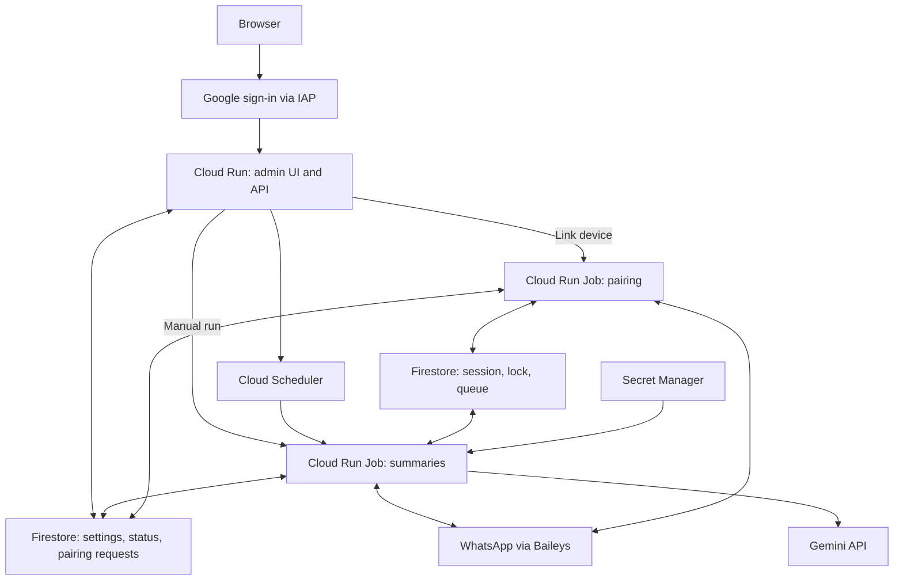

# ADR-0001: Scheduled execution of the WhatsApp bot on GCP

**Date:** 2026-10-07 · **Status:** Implemented; production validation pending.
**Updated:** 2026-10-09 — multiple configurations and shared scheduled dispatch.

## Decision

Run the bot as a **Cloud Run Job triggered by Cloud Scheduler**. A shared
Scheduler checks due configurations every 30 minutes; each configuration chooses
30 minutes, one hour, or four hours in its own time zone. Each run connects once
to WhatsApp, collects messages, sends eligible summaries, and exits.

A small **admin UI and API on Cloud Run** manages configurations, device pairing,
and runs. It stores versioned configurations in Firestore and reconciles Scheduler.
Bot Jobs store the WhatsApp session and processing state in Firestore;
Secret Manager holds the Gemini key. A separate, temporary pairing Job uses the
same bot image to link the device from the browser.

**Before adopting this design, verify that WhatsApp delivers all expected messages
after one and four hours offline.** Report delays of several hours must also be
acceptable. If offline recovery is incomplete, use a continuously running VM.

## Why this approach?

The [current bot](../../src/whatsapp.js) keeps a WebSocket open, scans on a timer,
and saves its session and queue to local files. An HTTP function cannot reliably
continue this background work after returning a response.
[Function lifecycle limits](https://docs.cloud.google.com/run/docs/tips/functions-best-practices).

A Job fits a process that finishes and exits. The admin service reuses the Node.js
24 and GCP patterns from `../cloud-functions`, serving HTML and a JSON API from one
origin with minimum instances set to zero.

## How it works

Scheduler starts the Job through the
[Cloud Run Jobs API](https://docs.cloud.google.com/run/docs/execute/jobs-on-schedule).
The API accepting a run does not mean the bot finished successfully.

Each run:

1. Reads a fixed settings version and acquires an expiring lock for the WhatsApp
   account. If another run holds the lock, it exits.
2. Restores the session and pending work, connects, and collects available messages
   within a bounded synchronization window.
3. Retries saved reports, summarizes eligible chats, and records delivery progress.
4. Closes the connection, finishes pending writes, releases the lock, and exits.

Start with **1 vCPU, 512 MiB, one task, a 10-minute timeout, and at most one retry**.
The worker needs its own deadline with time left for shutdown. Place it near the
Firestore database. The initial deployment uses `europe-west4`, alongside the
project's existing databases. Adjust resources after measuring.

## Admin experience

The first version supports one WhatsApp account and a small allowlist of
administrators, with three views:

| View | What the administrator can do |
| --- | --- |
| Overview | See the linked device, configuration count, next scheduled run, recent outcomes, queue age, and errors. |
| Configurations | Add, remove, expand, or collapse named configurations. Each has its own [bot settings](../../config.json.example), time zone, schedule, and Run now button. Run all launches every saved configuration, including paused ones, in one Job. |
| Device connection | Link or re-link a device, scan the current QR code, cancel pairing, and see success, expiry, or failure. |

Between scheduled runs, a closed WhatsApp connection is expected. Show **Linked**
with the last verification time, separately from **Running**, **Paused**, or
**Needs pairing**. An accepted manual run appears as queued until the worker starts;
show success only after it finishes. Poll status only while the page is visible.
Do not show conversation content or credentials in the admin UI.

Protect the entire service with
[IAP directly on Cloud Run](https://docs.cloud.google.com/run/docs/securing/identity-aware-proxy-cloud-run),
using Google sign-in and an explicit account allowlist. This avoids a separate
load balancer. Gmail accounts and projects without an organization require the
documented external/custom OAuth setup. Validate the
[signed user identity](https://docs.cloud.google.com/iap/docs/signed-headers-howto)
in the backend and protect state-changing requests against CSRF.

The browser calls only the admin API. That API owns settings validation, version
checks, schedule reconciliation, and Job invocation. Repeated Run now or Pair
requests use idempotency keys; every execution also respects the shared account
lock. API responses expose operation IDs and sanitized status, not GCP tokens.
Grant the API read/cancel access to the two Job definitions; reconcile stale UI
status with Cloud Run execution state if a worker terminates before reporting.
Keep raw logs in Cloud Logging and Gemini secrets in deployment configuration.
Use `#configurations` for the list and `#configurations/ID` for an expanded item.
Redirect existing `#settings` links to the list. All configurations share one
linked device and account lock, with independent queues and delivery progress.

## Pairing from the browser

Use a dedicated Job definition running the bot image in a proposed `--pair` mode:
one task, a five-minute deadline, no automatic retries, and no summary generation.
The admin API returns after starting it; the Job owns the WhatsApp connection.
This keeps pairing independent of browser refreshes and HTTP request lifetimes.

1. The administrator chooses **Link device**. The API marks the account as under
   maintenance and pauses future runs. Pairing starts only after any active bot
   run finishes or is cancelled, and acquires the same account lock.
2. Baileys generates a QR challenge. The Job writes the latest challenge and its
   expiry to a private pairing record. The initiating administrator's browser
   polls the authenticated API every few seconds and renders the current QR.
3. The administrator scans it in **WhatsApp → Linked devices → Link a device**.
   Handle Baileys' expected restart after pairing, save all credentials and keys
   continuously, and verify reconnection without a fresh QR before reporting
   **Linked**. Persist matching messages received during pairing and wait through
   the bounded synchronization window; WhatsApp may not replay that history to
   a later Job. Pairing does not generate or send reports.
   [Baileys pairing flow](https://github.com/WhiskeySockets/baileys.wiki-site/blob/main/docs/socket/connecting.md).
4. The Job closes its connection and clears the QR. The account remains paused
   until the administrator explicitly enables the schedule.

Re-linking creates a separate session generation and activates it only after
verification, under the account lock. Preserve the pending queue and reports.

QR responses use `Cache-Control: no-store`; challenges never enter URLs or logs.
Return a challenge only to the initiating administrator and reject expired
records even if cleanup has not run. Cancel, expiry, or failure ends the attempt
and leaves scheduling paused; refreshing the page resumes status checks without
starting another Job. Cancellation must stop the Job, not just hide its QR.
Logout sets `needsPairing` and blocks normal runs until pairing succeeds.
An existing local session can still be imported after stopping the local bot.

Keep control data (settings, sanitized status, temporary QR records) in a separate
Firestore database from runtime data (credentials, keys, queue, and account lock).
The admin service account accesses only the control database; only worker service
accounts access the runtime database. Use database-scoped
[IAM conditions](https://docs.cloud.google.com/firestore/native/docs/manage-databases)
and verify denied runtime reads: collection names alone do not isolate server
credentials. Cross-database updates are not atomic; maintenance checks and the
account lock must keep pairing exclusive even after partial failures.

This prevents direct runtime reads by the admin identity. Execution overrides
also permit changing container arguments, so admin/Scheduler identities remain
trusted control-plane identities with indirect worker privileges. For a stronger
boundary, add a fixed-argument launcher and remove their override permission.
The browser API accepts no arbitrary Job arguments or environment variables.

## Configurations and scheduling

Firestore is the source of truth. The configuration service validates settings,
saves immutable versions, and updates Scheduler. Pass the account ID, schedule
revision, request ID, and configuration selection through
[execution overrides](https://docs.cloud.google.com/run/docs/execute/jobs#override_job_configuration_for_a_specific_execution);
the worker loads settings at startup. Changes take effect on the next run without
redeploying the container.

Keep `period` as each configuration's frequency setting. These expressions
describe local due times, rather than separate Scheduler jobs:

| `period` | Scheduler cron | Run times |
| --- | --- | --- |
| `30min` | `*/30 * * * *` | Every hour at :00 and :30 |
| `1h` or `60min` | `0 * * * *` | Every hour at :00 |
| `4h` | `0 */4 * * *` | 00:00, 04:00, 08:00, 12:00, 16:00, 20:00 |

Use an explicit time zone, initially `Europe/Istanbul`. These are clock-based
due times, not intervals after a run finishes. Accept only the listed
durations after normalization; reject unsupported values such as `90min`.
Local continuous mode keeps its existing interval behavior. The single Scheduler
runs at `*/30 * * * *` in UTC and pauses when no configuration is enabled.
The worker remembers each successfully processed schedule slot; delayed starts
still identify due work. Time zones with quarter-hour offsets may wait until the
next shared tick. Manual runs also work with scheduling paused.

Firestore and Scheduler cannot be updated atomically. Track desired and applied
schedule revisions, expose `pending`/`error`, and provide an idempotent protected
`reconcile` endpoint to retry incomplete changes. Workers skip stale revisions
and select only enabled, due configurations for scheduled runs. Pausing stops
automatic summaries; a connection collects matching input for every saved
configuration, preserving it in separate queues. Cancelling an active run is
a separate action. One failed configuration preserves its work while other
selected configurations can finish.

Existing reports retain their original recipients and settings version.
Configuration changes must preserve queued work; replaying history is explicit.
Existing settings appear as **Default configuration**, retaining the old runtime
queue and acknowledgements. New configurations use separate runtime namespaces.
Removal is refused during an active operation or while a configuration has
pending work. Up to 20 configurations are supported.
`waitForNoActivity` checks the newest message in each chat. Active chats wait
until a later run, rather than keeping the Job alive.

## Reliability and access

The following requirements are essential:

- **Recover offline messages.** Add `messages.upsert` support for `append` as well
  as `notify`, preserving deduplication and exclusion of the bot's own reports.
  [Baileys events](https://github.com/WhiskeySockets/baileys.wiki-site/blob/main/docs/socket/receiving-updates.md).
  Neither `syncFullHistory=true` nor a timeout guarantees completeness.
  Advance the history checkpoint only after successfully saving a `FULL` sync
  with `progress=100`; `isLatest` marks the first notification.
- **Persist continuously.** Cloud Run's
  [local files are temporary](https://docs.cloud.google.com/run/docs/container-contract#file_system_access).
  Save all Baileys credentials and session/encryption keys as they change,
  plus messages, processed IDs, checkpoints, reports, and recipient/part progress.
  Use separate Firestore documents rather than one growing state document.
- **Prevent overlapping runs.** One task per execution does not prevent separate
  executions from overlapping. Renew the account lock, check an ownership version
  (fencing token) on writes, and stop if ownership is lost.
- **Expect at-least-once delivery.** Save reports before sending; acknowledge only
  work delivered to every intended recipient. A crash after WhatsApp accepts a
  part but before its progress is saved can still cause a duplicate.
- **Keep management private.** Separate service accounts for configuration,
  invocation, and runtime. Scheduler uses OAuth for Jobs API calls; overrides
  require `run.jobs.runWithOverrides`, and cancellation requires
  `run.executions.cancel`.
  [Authentication](https://docs.cloud.google.com/scheduler/docs/http-target-auth)
  and [execution permissions](https://docs.cloud.google.com/run/docs/execute/jobs).
  Restrict WhatsApp session/key access to worker identities, and Gemini secret
access to the summarization worker only.

Cloud Scheduler does not support resource-name IAM Conditions. Schedule
reconciliation needs a project-level custom role containing only `jobs.get`,
`jobs.update`, `jobs.pause`, and `jobs.enable`; the deployer creates the job.
This role can affect other Scheduler jobs in the same project, so its grant is
explicit. The API itself uses a fixed job name. Use a dedicated project when
stronger isolation is needed. [Supported condition resources](https://docs.cloud.google.com/iam/docs/conditions-resource-attributes).

Stop the local bot before pairing or enabling cloud runs. Both scheduled and
manual summary runs check maintenance and authorization state before connecting.
Workers publish sanitized run status for the admin UI without chat content.

Monitor run failures and duration, queue age, synchronization, authentication,
schedule revisions, and quota usage.

## Can it fit the free tier?

**Potentially, but a zero bill is not guaranteed.** Estimates below are dated
2026-10-07, for `us-central1`. Existing workloads may already use the allowances;
remaining quotas in the target project have not been audited.

Cloud Run Jobs include **240,000 vCPU·s and 450,000 GiB·s per month**, with a
minimum one-minute charge per task execution.
[Cloud Run pricing](https://cloud.google.com/run/pricing).

Assuming 1 vCPU, 512 MiB, a 30-day month, **two minutes per complete run**, and no
retries:

| Frequency | Runs/month | CPU hours/month | Memory usage, GiB·s |
| --- | ---: | ---: | ---: |
| Every hour | 720 | 24 | 43,200 |
| Every four hours | 180 | 6 | 10,800 |

Both fit the compute allowances if unused. These are estimates, not measured bot
runtimes. By contrast, `period=10min` exceeds the free CPU allowance even at the
one-minute billing minimum.

Scheduler includes three free jobs per billing account; this design uses one per
bot. [Scheduler pricing](https://cloud.google.com/scheduler/pricing).
Only one Firestore database per project receives the free allowance; check the
selected database and operation volume.
[Firestore pricing](https://cloud.google.com/firestore/pricing).

The admin service adds request-based compute, and pairing adds short Job runs and
temporary polling reads. Both scale down when unused. Standard Google Cloud IAP
protection has [no separate charge](https://cloud.google.com/iap/pricing).
The second Firestore database has usage charges because the free allowance applies
to only one database; include these in the estimate rather than assuming the
admin UI is entirely free.

Account separately for secrets, image storage, builds, logs, outbound traffic,
and [Gemini usage](https://ai.google.dev/gemini-api/docs/pricing).

## Alternatives

| Option | Trade-off |
| --- | --- |
| Gen2 HTTP function | Works if the entire cycle finishes before the response; needs the same persistence and synchronization changes. |
| Continuous Cloud Run service | Keeps the connection alive, but always-allocated compute costs about $44/month at 1 vCPU and 512 MiB over 30 days after unused free allowances. |
| Compute Engine `e2-micro` | Best fallback for continuous operation; requires VM maintenance. Eligible compute can be free, but public IPv4 adds about $3.65/month. IPv6-only connectivity is unverified. |
| Minute-by-minute dispatcher | Supports many bots and arbitrary intervals, but adds scheduling and recovery logic unnecessary for one bot. |

VM eligibility and address charges:
[Compute Engine Free Tier](https://docs.cloud.google.com/free/docs/free-cloud-features),
[IP pricing](https://cloud.google.com/vpc/network-pricing).

## Implementation and rollout

1. Add `--once`, offline `append` ingestion, a deadline, and graceful shutdown.
2. Add Firestore configuration/state/auth adapters and the account lock.
3. Verify known message IDs after 1h and 4h offline, including groups and media
   captions. Test missing sync completion, retries, crashes, overlapping runs,
   lease loss, logout, and forced timeout.
4. Deploy the bot and pairing Jobs plus the IAP-protected admin UI/API. Test login
   and denied access, settings conflicts, schedule reconciliation, manual runs,
   and recovery from partial updates. Verify pairing success, QR refresh/expiry,
   browser refresh, cancellation, logout, and exclusivity with scheduled runs.
5. Check quotas, measure actual resource and Gemini usage, and enable the 4h
   schedule. Move to 1h only with sufficient headroom.

The scheduled and pairing modes, Firestore adapters, account lease, admin UI/API,
and CLI deployment are implemented. See the [deployment guide](../gcp-deployment.md)
for setup and verification. Live pairing and a complete worker execution have
been verified. New accounts start with scheduling paused. Delivery of a nonempty
summary and one-/four-hour offline completeness still require operator
verification to complete production validation.
